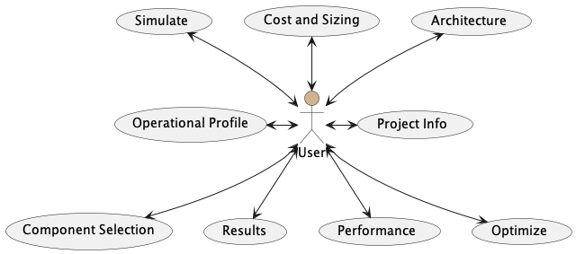
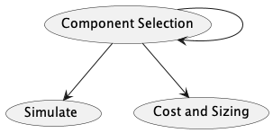

# Developer Guide

-----

## Content Page
1. [Introduction](#1-introduction)
2. [Setting up](#2-setting-up)
3. [Design](#3-design)
    1. [High Level Architecture](#31-high-level-architecture)
    2. [Project Info](#32-project-info)
    3. [Architecture](#33-architecture)
    4. [Operational Profile](#34-operational-profile)
    5. [Component Selection](#35-component-selection)
    6. [Cost and Sizing](#36-cost-and-sizing)
    7. [Simulate](#37-simulate)
    8. [Results](#38-results)
    9. [Performance](#39-performance)
    10. [Optimize](#310-optimize)
4. [Implementation](#4-implementation)
    1. [Project Info](#41-project-info)
    2. [Architecture](#42-architecture)
    3. [Operational Profile](#43-operational-profile)
    4. [Component Selection](#44-component-selection)
    5. [Cost and Sizing](#45-cost-and-sizing)
    6. [Simulate](#46-simulate)
    7. [Results](#47-results)
    8. [Performance](#48-performance)
    9. [Optimize](#49-optimize)
    10. [Menu](#410-menu)
    11. [Ready Map](#411-ready-map)
    12. [General Functions](#412-general-functions)

-----

## 1. Introduction
IPSOMEDT_Marine is a tool for marine engine development.
This developer guide provides information on the architecture and design of the application. 
It aims to provide a fast and efficient reference for code understanding, testing, debugging, and maintenance.
It will not only help you get started as a IPSOMEDT_Marine contributor, but that you will find useful to refer to even if you are already a contributor of this project.

## 2. Setting up
As a developer, this program requires the installation of MATLAB.

## 3. Design
### 3.1 High Level Architecture

### 3.2 Project Info

### 3.3 Architecture

### 3.4 Operational Profile

### 3.5 Component Selection

### 3.6 Cost and Sizing

### 3.7 Simulate

### 3.8 Results

### 3.9 Performance

### 3.10 Optimize

## 4. Implementation
### 4.1 Project Info
* `AuthorEditFieldValueChanged`:
  * Updates variable based on user inputs for **Author**
* `DateEditFieldValueChanged`:
  * Update variable based on user inputs for **Date**
* `ProjectEditFieldValueChanged`:
  * Update variable based on user inputs for **Project**

### 4.2 Architecture
* `updateSingleLineDiagram`:
  * Initialises variables for **Number of Components per Busbar**
  * Initialises components and display style for **Single Line Diagram**
  * Plots **Single Line Diagram** on both positive and negative sides
* `updateArchitecture`:
  * Updates variables based on user inputs for **Architecture Parameters**
  * Updates variables based on user inputs for **Busbar Type**
  * Updates variables based on user inputs for **Number of Components per Busbar**
  * Adds selection options for **Plot selection** in **Simulate**
  * Adds selection options for **Left plot** and **Right plot** in **Results**
  * Toggles visibility for **Component Selection**
  * Enables **Run GT-Suite checkbox** in **Results**
  * Enables editability for **Component Selection**
  * Calls `ClearTableButtonPushed`, `updateOperationalProfile`, `updateSingleLineDiagram`, `updateSfcResultsTable`
* `BusbartypeButtonGroupSelectionChanged`:
  * Enables **Frequency (Hz)** based on user selected busbar type
* `ShoreConnectionAvailDropDownValueChanged`, `BoostAlloweDropDownValueChanged`, `nDgDropDownValueChanged`, `nTdDropDownValueChanged`,
  `nAuxLoadDropDownValueChanged`, `nEssDropDownValueChanged`, `nHsgDropDownValueChanged`, `nFCDropDownValueChanged`:
  * Calls `updateArchitecture`, `updateComponentSelectionTable`, `updateCostandSizeTable`
  
### 4.3 Operational Profile
* `updateOperationalProfile`:
  * Enables and initialises entry fields for **Average Load**
  * Populates column names on **Table**
  * Initialises table variables
* `PropellermModeDropDownValueChanged`:
  * Updates and initialises **HSG prop. speed (rpm)** based on user selection for **HSG propeller mode**
* `AutogeneratepeopellerrpmCheckBoxValueChanged`:
  * Enables **HSG prop. speed (rpm)** based on user selection for **Auto-generate propeller rpm** 
  * Calls `HSGproploadkWEditFieldValueChanged`
* `HSGproploadkWEditFieldValueChanged`:
  * Computes and updates column 1 of **HSG prop. speed (rpm)**
  * Calls `computeMeWrpmP`
* `HSGproploadkWEditField2ValueChanged`:
  * Computes and updates column 2 of **HSG prop. speed (rpm)**
  * Calls `computeMeWrpmP`
* `AddTaskButtonPushed`:
  * Populates and append new task row to **Table** based on user selected row index and user input task information
  * Sorts task rows based on index for **Table** 
* `TasktypeDropDownValueChanged`:
  * Enables and initialises **Shore power (kW)** based on user selected **Task type**
* `DeleteTaskButtonPushed`:
  * Deletes task row form **Table** based on user selected row index
* `ClearTableButtonPushed`:
  * Clears plots of **Operational Profiles** for **Simulate**, **Simulation Plots** for **Results**
  * Clears tables of **Table** for **Operational Profile**, **Summary** for **Results**, **Fuel Consumption Table** for **Results**
  * Calls `updateDataSimVar`
* `ImportfromExcelButtonPushed`:
  * Imports data from Excel that is matched with the user selected architectures
* `OpTaskTableDisplayDataChanged`:
  * Updates variables values for **Table** after user manually edits cell values in **Table**
* `OpTaskTableCellSelection`:
  * Gets and updates **at index** based on the position of the cells selected by user from the **Table** 

### 4.4 Component Selection
* `updateComponentSelectionTable`:
  * Obtains variables values based on user inputs for **Component Selection**
  * Computes and outputs **List of Components** in **Simulate**
  * Outputs **Display of Component Parameters**
* `InitializeComponentTable`:
  * Initialises variables
  * Initialises column formats and column names
  * Adds selection options 
* `UITableEngineHSGDisplayDataChanged`, `UITableEngineDGDisplayDataChanged`, `UITableHotelConvDisplayDataChanged`, `UITableFCDisplayDataChanged`,
`UITableESSDisplayDataChanged`:
  * Calls `updateComponentSelectionTable`, `updateCostandSizeTable`

### 4.5 Cost and Sizing
* `updateCostandSizeTable`:
  * Undates variable values from user inputs
  * Writes the values to Excel file
  * Reads data from Excel file and displays on **Table**
* `Acload_RatedpowerkWEditFieldValueChanged`, `PowerinputkWEditField_2ValueChanged`, `ESS_RatedenergykWhEditFieldValueChanged`,
`DG_RatedpowerkWEditFieldValueChanged`, `NumberofcomponentsDropDownValueChanged`, `SelectgensetfromlistDropDownValueChanged`,
`NoofACloadsDropDownValueChanged`, `ShoreDropDownValueChanged`, `ACload_RatedpoerkWEditFieldValueChanged2`, 
`Shore_RatedpowerkWEditFieldValueChanged`:
  * Calls `updateCostandSizeTable`

### 4.6 Simulate
* `updateDataSimVar`:
  * Clear and read data from the library, **User-defined Parameters**, and **Operational Profile**
  * Initialises simulation variables
* `ESSnParEditFieldValueChanged`:
  * Computes and updates values for **ESS energy capacity (kWh)**, **Max ESS charging P (kW)**, and **Max ESS discharging P (kW)**
for **Simulate** after user manually edits the value of **No. of ESS cells in parallel** for **Simulate**
  * Calls `updateCostandSizeTable`
* `LoadPlotselectionDropDownValueChanged`:
  * Plots the results on **Operational Profile** in **Simulate** based on user selected **Plot selection**
  * Calls `updateDataSimVar`
* `OptimizationoptionDropDownValueChanged`:
  * Enables **Final ESS SOC (%)**, **Fuel cost for opt. ($)**, **Hydrogen cost for opt. ($)**, **Shore energy cost ($/kWh)**, **Hydrogen limit** in **User-defined Parameters** based on user selected **Optimization option**
* `SimulateButtonPushed`:
  * Calls `updateDataSimvar`, `updateResultsTable`, `ResultsRightyaxisDropDownValueChanged`, `ResultsLeftyaxisDropDownValueChanged`, `computePMS`, `opti_IPSOMEDTV3`
  * Run the simulation based on user selected **Optimization option**
  * Resets **Left plot** and **Right plot** in **Results** to the default value of 'None'
  * Updates **Simulation plots** and **Fuel Consumption Table** in **Results**
  * Displays 'Ready' in green for **Ready Map** after simulation completed

### 4.7 Results
* `updateSfcResultsTable`:
  * Populates column names on **Fuel Consumption Table**
  * Initialises table variables
* `updateResultsTable`:
  * Computes, appends, and updates **Fuel Consumption Table**
  * Computes and updates **Summary**
* `updateResultsPlot`:
  * Sets display style and plots results on **Simulation Plots** based on user selection
  * Plots GT results on **Simulation Plots** if selected
* `ResultsLeftyaxisDropDownValueChanged`:
  * Updates variable value for **Left plot** based on user selected option for **Left plot**
  * Calls `updateResultsPlot`
* `ResultsRightyaxisDropDownValueChanged`:
  * Updates variable value for **Right plot** based on user selected option for **Right plot**
  * Calls `updateResultsPlot`
* `RunGTSuiteButtonPushed`:
  * Packs data and outputs to an Excel file
  * Run GT-Suite, which is a third-party industry-standard engine simulation library, on the Excel file
  * Imports the results from the Excel file after GT-Suite simulation is finished
  * Enables **include GT Results in plots** checkbox
  * Calls `GTChangeModelParameter`, `GTFindIdx`, `GTReadData`
* `PlotGTCheckBoxValueChanged`:
  * Calls `ResultsRightyaxisDropDownValueChanged`, `ResultsLeftyaxisDropDownValueChanged`

### 4.8 Performance
* `updatePerformancePlot`:
  * Plots computed results on **Performance Plots** based on user selection of **Performance plot to display**
* `AddNewRowButtonPushed`:
  * Populates new task row on **Ship Resistance Table**
  * Sets variables of the new task row to the default value of 0
* `DeleteSelectedRowButtonPushed`:
  * Deletes user selected rows from **Ship Resistance Table**
* `ShipResistanceTableCellSelection`:
  * Gets and updates variable based on the positions of the cells selected by user from the **Ship Resistance Table**
* `ComputePerformanceButtonPushed`:
  * Reads data from libraries, **Simulate**, **Ship Resistance Table**
  * Computes performance
  * Calls `updatePerformancePlot`, `computePerformance`
* `PerformancePlotChoiceDropDownValueChanged`:
  * Calls `ComputePerformanceButtonPushed`
* `PerformancePlotsHoldButtonValueChanged`:
  * Retains current plots when adding new plots for **Performance plots**
* `PerformancePlotClearButtonPushed`:
  * Clears current plots when adding new plots for **Performance plots**

### 4.9 Optimize
* `checkOptConstraints`:
  * Checks optimisation constraints
* `CopyfromPerformanceTabButtonPushed`:
  * Fills in the data for **Optimization constraints** from **Performance Results**
* `OptimizeButtonPushed`:
  * Runs optimisation
  * Displays messages on **Optimization log**
  * Calls `ComputePerformanceButtonPushed`, `checkOptConstraints`

### 4.10 Menu
* `LoadSessionMenuSelected`:
  * Fills all sections based on data from loaded .mat file
  * Loads data from .mat file and fills up **Project Info**, **Architecture**, **Simulate**, **Performance**
  * Populates **Table** in **Operational Profiles**
  * Selects components in **Component Selection**
  * Clears all figures and results tables
  * Selects plotting options for **Plot selection** in **Simulate**, **Left plot** and **Right plot** in **Results** if needed
  * Selects **include GT results** checkbox in **Results** if needed
  * Calls `ClearTableButtonPushed`, `BusbarTypeButtonGroupSelectionChanged`,
`PropellerModeDropDownValueChanged`, `updateComponentSelectionTable`, `ESSnParEditFieldValueChanged`, `updateDataSimVar`, 
`LoadPlotselctionDropDownValueChanged`, `ComputePerformanceButtonPushed`, `ResultsLeftaxisDropDownValueChanged`, 
`ResultsRightaxisDropDownValueChanged`, `updateResultsTable`, `updateCostandSizeTable`
* `SaveSessionMenuSelected`:
  * Saves variables values and exports to .mat file
* `RefresheddisplaymessageMenuSelected`:
  * Displays 'ready' in green as the **Ready Map**
* `ExporttoPowerPointMenuSelected`:
  * Exports results to PPT slides
  * Calls `GenerateTableInPowerpoint`, `PlotExcel2DDiagram`, `PlotExcel2DIntoPowerpoint`

### 4.11 Ready Map
* `displayErrorMessage`:
  * Displays current error messages

### 4.12 General Functions
* `clearEditField`:
  * Clears and resets all user inputs to the default value of 0
* `save_close_excelfile`:
  * Saves the results to an Excel file
* `startUpFcn`:
  * Imports component libraries, functions, and testing files
  * Calls `initializeComponentTable`, `updateArchitecture`, `BusbarTypeButtonGroupSelectionChanged`, `updateCostandSizeTable`, and `updateComponentSelectionTable`
  * Updates variables based on user inputs for **Project Info**
  * Adds date for user selection
  * Initialises **Ship Resistance** Table in **Performance**
  * Formats alignment for **Fuel Consumption Table** in **Results** and **Ship Resistance Table** in **Performance**
* `computeEmPmaxWrpm`:
  * Computes for eMotor power limits at different shaft speeds
* `computeMePwrpm`:
  * Computes for engine shaft speed deviations based on engine-propeller curve
  * Calls `computeEmPmaxWrpm`
* `computeMeWrpmP`:
  * Computes for engine shaft speed deviations based on engine-propeller curve
  * Calls `computeEmPmaxWrpm`
* `computePerformance`:
  * Computes performance
  * Calls `computeEmPmaxWrpm`, `computeMePwrpm`, `computeMeWrpmP`
* `computePMS`:
  * Computes PMS by following General Power Flow Control Implementation Logic
* `GenerateTableInPowerpoint`:
  * Generates table in PPT
* `GTChangeModelParameter`:
  * Changes GT model parameters
* `GTFindIdx`:
  * Finds index of a variable within a GTData structure based on the provided name
* `GTReadData`:
  * Read GTData from files
* `opti_IPSOMEDTC3`:
  * Runs optimisation
* `PlotExcel2DDiagram`:
  * Plots Excel 2D Diagram
* `PlotExcel2DIntoPowerpoint`
  * Plots Excel 2D Diagram on PPT slides

